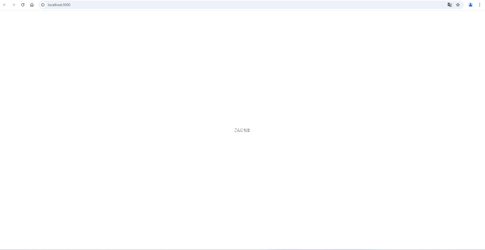
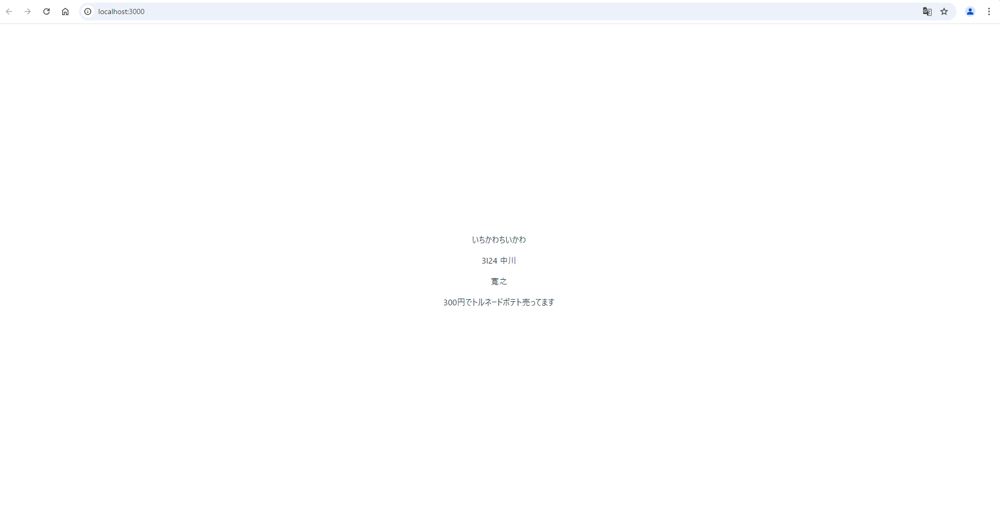
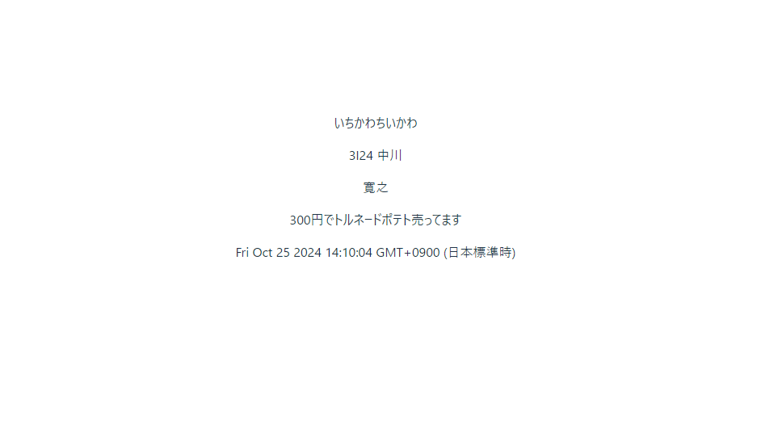
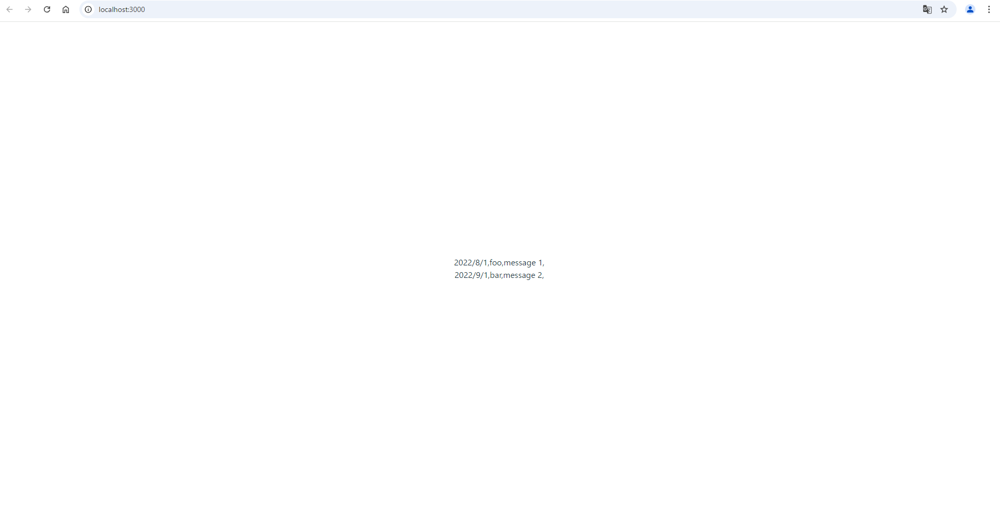
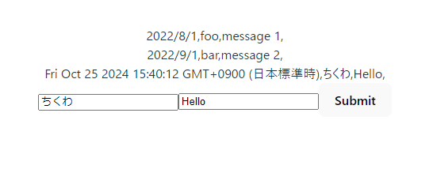

# WebApp2

## 課題１-1

```tsx
function App() {
  return (
    <div className="App">
      <header className="App-header">
        <Sample></Sample>
        <Sample2 prop="3I24 中川" ></Sample2>
        <Sample3 prop={{name:"寛之",message:"300円でトルネードポテト売ってます"}}></Sample3>
      </header>
    </div>
  );
}
```

```tsx
const Sample2:React.FC<{prop:String}> = ({prop}) => {
  return (
    <div key="Sample2">
      <p>{prop}</p>
    </div>
  )

}

const Sample3:React.FC <{prop:{name:String, message:String}}> = ({prop}) =>{
  return (
    <div key="Sample3">
      <br>{prop.name}</br>
      <p>{prop.message}</p>
    </div>
  )
}
```

## 写真フォルダー








